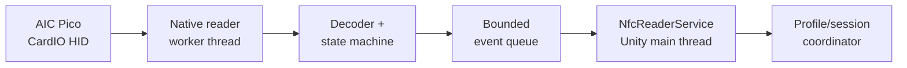

<div align="center">

# TechmaniaNfcHook

**Use an AIC Pico NFC reader as an arcade-style login device in TECHMANIA.**

[](https://github.com/ryukikiyomizu/TECHMANIANFCHook/releases/latest)
[](https://github.com/ryukikiyomizu/TECHMANIANFCHook/releases/latest)
[](https://github.com/ryukikiyomizu/TECHMANIANFCHook)
[](docs/UNITY-INTEGRATION.md)

</div>

TechmaniaNfcHook converts AIC Pico CardIO HID reports into a small, stable event
API that Unity can poll without blocking its main thread. It supports the two
card identities emitted by the firmware:

- FeliCa / amusement IC (`report 1`)
- MIFARE Ultralight / NTAG (`report 2`)

The project is a standard Unity native plugin loaded through `DllImport`. It
does **not** inject into the game, patch imports, replace a Windows system DLL,
or communicate through the Pico's serial ports.

## What it provides

- Exact discovery of the AIC Pico CardIO HID interface
- Blocking USB reads isolated on a native worker thread
- A bounded event queue for safe Unity main-thread polling
- Card-present and card-removed transitions without duplicate held-card events
- A redacted hardware probe that never prints raw card IDs
- Graceful fallback: NFC can be absent while USB login and Guest play continue
- Native unit tests plus Unity-side contract tests

## Requirements

| Component | Requirement |
| --- | --- |
| Operating system | Windows 10 or 11, x64 |
| Game integration | TECHMANIA Unity project, x86_64 player/editor |
| Reader | AIC Pico with the CardIO HID interface enabled |
| CardIO identity | VID `CAFF`, PID `400E`, usage page `FFCA`, usage `0001` |
| Supported cards | FeliCa / amusement IC and MIFARE Ultralight / NTAG |

> [!IMPORTANT]
> This repository provides the bridge and integration source. It does not bundle
> TECHMANIA, AIC Pico firmware, or card data.

## Quick start

### 1. Configure and verify the reader

Configure the board with the upstream
[AIC Pico Configurator](https://whowechina.github.io/aic_pico/Configurator/index.html),
then close the configurator and any other application that may hold the CardIO
interface.

Download `TechmaniaNfcProbe.exe` from the
[latest release](https://github.com/ryukikiyomizu/TECHMANIANFCHook/releases/latest)
and run:

```powershell
./TechmaniaNfcProbe.exe --seconds 30
```

A working setup reports `reader connected`. Tapping and removing a card reports
only its kind and presence transition; the credential itself is redacted.

### 2. Install the Unity plugin

1. Copy `TechmaniaNfcHook.dll` to
   `TECHMANIA/Assets/Plugins/x86_64/TechmaniaNfcHook.dll`.
2. Copy `unity/Runtime/TechmaniaNfcNative.cs` and
   `unity/Runtime/NfcReaderService.cs` into a runtime scripts folder.
3. In Unity's plugin importer, enable **Editor** and **Standalone** for Windows
   x86_64 only.
4. Create one `NfcReaderService` in the process-wide profile/session owner.
5. Start it after profile storage initializes, poll it during the login/session
   loop, and dispose it when the application exits.

See [Unity integration](docs/UNITY-INTEGRATION.md) for the managed example and
profile contract. Themes should use only the reader-neutral `tm.profile`
functions documented in [Theme hooks](docs/THEME-HOOKS.md).

> [!NOTE]
> If the DLL or reader is unavailable, NFC disables itself. Keep the existing
> USB-login and Guest paths enabled.

## How it works



The native side owns device discovery and blocking I/O. Unity only drains an
already-populated queue, so a card read cannot stall rendering. Authentication
and physical presence remain separate: removing a card never logs the player
out, while the game can still show a “remove your card” prompt before exit.

For the full design and failure model, read [Architecture](docs/ARCHITECTURE.md).

## Build from source

Install Visual Studio 2022 or newer with **Desktop development with C++**,
CMake 3.25+, and Ninja. From an x64 Visual Studio developer shell:

```powershell
./scripts/build.ps1
```

The script configures a Release build, compiles the DLL and probe, and runs the
native test suite. Outputs are written to `build-ninja/`:

| Artifact | Purpose |
| --- | --- |
| `TechmaniaNfcHook.dll` | Unity x64 native plugin |
| `TechmaniaNfcProbe.exe` | Redacted reader and card-presence diagnostic |
| `techmania_nfc_tests.exe` | Native test runner |

To deploy a local build into a TECHMANIA Unity project:

```powershell
./scripts/deploy-techmania.ps1 -ProjectPath "C:\path\to\TECHMANIA"
```

The deployment helper validates the project and verifies the copied DLL by
SHA-256. See [Building](docs/BUILDING.md) for the individual CMake commands.

## Documentation

| Guide | Use it for |
| --- | --- |
| [Hardware setup](docs/HARDWARE-SETUP.md) | CardIO identifiers, reports, and Pico configuration |
| [Unity integration](docs/UNITY-INTEGRATION.md) | Installation, lifecycle, and profile contract |
| [Theme hooks](docs/THEME-HOOKS.md) | Reader-neutral `tm.profile` functions |
| [Native ABI](docs/ABI.md) | Exported C interface and compatibility rules |
| [Architecture](docs/ARCHITECTURE.md) | Threads, queue, session behavior, and failure containment |
| [Troubleshooting](docs/TROUBLESHOOTING.md) | Reader detection, DLL loading, and ABI errors |
| [Building](docs/BUILDING.md) | Toolchain, build, test, and artifact verification |

## Security and privacy

Treat card identities as credentials. Do not log or expose the FeliCa IDm,
MIFARE UID, or the derived `credentialKey`. The included probe intentionally
reports only reader state, card kind, and presence transitions. Themes never
receive the raw NFC identity.

## Scope and upstream projects

This bridge targets the public CardIO behavior of
[whowechina/aic_pico](https://github.com/whowechina/aic_pico). The upstream
author maintains the hardware, firmware, and configurator separately; no AIC
Pico source or firmware is vendored here.

TECHMANIA itself is maintained separately by the
[TECHMANIA team](https://github.com/techmania-team/techmania).

## Support

If this project helped you, you could donate some coffee for me—no pressure :3

[](https://buymeacoffee.com/ryukikiyomizu)

## License

Copyright © 2026 Ryuki. This source is available under a custom, permission-only
license. Read [LICENSE](LICENSE) before using, copying, modifying, or
redistributing it.

Author: [Ryuki](https://github.com/ryukiyomizu). See [AUTHORS.md](AUTHORS.md).
